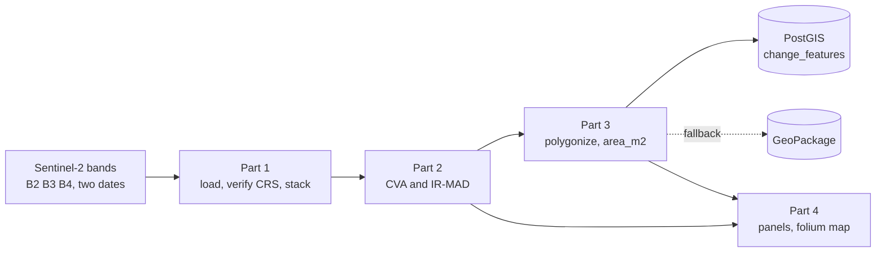

# Sentinel-2 Change Analysis

A small, reproducible geospatial pipeline that detects, stores and visualizes land-surface change
between two Sentinel-2 acquisitions of the Lumwana open-pit copper mine in Zambia
(2023-08-12 and 2023-09-02).

It runs the five assignment parts end to end (load and stack, change detection, vectorize, spatial
database, visualize) and the analysis is written up in [report.md](report.md).



## 1. Setup

Use Python 3.13. Python 3.14 has no stable rasterio/GDAL wheels yet.

```bash
py -3.13 -m venv .venv
.venv\Scripts\activate            # Windows;  source .venv/bin/activate on macOS/Linux
pip install -r requirements.txt
```

By default the pipeline reads the provided data from
`../Technical Assignment_DS/Technical Assignment/`. Point it elsewhere with an environment variable:

```bash
set SOLAFUNE_INPUTS=C:\path\to\Technical Assignment      # Windows
# export SOLAFUNE_INPUTS=/path/to/Technical Assignment   # macOS/Linux
```

## 2. Run

```bash
python -m src.pipeline               # both methods; PostGIS if available, else GeoPackage
python -m src.pipeline --no-postgis  # write the GeoPackage directly (no database server needed)
python -m src.pipeline --methods ir_mad --no-figures
```

Outputs:

In simple terms, the pipeline writes two kinds of results:

* `data/processed/`: the machine-readable outputs. This folder holds the stacked Sentinel-2 rasters,
  the change maps (`change_map_<method>.tif`), the black-and-white change masks
  (`change_binary_<method>.tif`), the visible-band difference rasters (`vari_diff.tif` and
  `brightness_diff.tif`), and the spatial database `change_features.gpkg`.
* `figures/`: the human-friendly outputs. This folder holds the summary plots, the method comparison
  image, the interactive Folium map (`interactive_map.html`), and the screen recording of that map
  (`folium-solafune.mp4`).

If you only want the short version: `data/processed/` is for the files the code produces, and
`figures/` is for the pictures and map you can look at.

## 3. Run step by step

To run each stage by hand instead of the orchestrator:

```python
from src import io_raster as io, config, preprocess, change_detection as cd
from src import vectorize, db, visualize

before = io.load_date_stack(config.DATE_BEFORE)      # Part 1
after  = io.load_date_stack(config.DATE_AFTER)
io.verify_consistency(before, after)
mask = before.valid_mask & after.valid_mask

b = preprocess.to_reflectance(before.data)           # Part 2
a = preprocess.relative_normalize(b, preprocess.to_reflectance(after.data), mask)
res = cd.ir_mad(b, preprocess.to_reflectance(after.data), mask)   # or cd.cva_magnitude(b, a, mask)

gdf = vectorize.polygonize(res, before)              # Part 3
print(db.store(vectorize.to_wgs84(gdf)))
visualize.static_panels(before, after, res)          # Part 4
```

## 4. Database

The assignment allows SQLite or PostGIS. Both are supported.

### 4a. PostGIS via Docker (preferred)

```bash
copy .env.example .env
docker compose up -d                  # postgis/postgis:16-3.4 on localhost:5432
python -m src.pipeline                # writes change_features, geometry(Polygon, 4326)
```

Inspect it with psql (or DBeaver / pgAdmin):

```bash
docker exec -it solafune_postgis psql -U solafune -d solafune
```
```sql
\d change_features                                                  -- columns and indexes
SELECT method, COUNT(*), ROUND(SUM(area_m2)::numeric,1) FROM change_features GROUP BY method;
SELECT ST_SRID(geometry), ST_GeometryType(geometry) FROM change_features LIMIT 1;   -- 4326, Polygon
SELECT COUNT(*) FROM change_features WHERE NOT ST_IsValid(geometry);                -- 0
```

Verified output (geometry is a real typed column with a GiST spatial index):

```text
                      Table "public.change_features"
     Column      |          Type          | ...
 id              | bigint                 |
 geometry        | geometry(Polygon,4326) |
Indexes: "idx_change_features_geometry" gist (geometry)

 method        | count |  total_m2
 ir_mad        |  554  | 11306200.0
 cva_magnitude |  483  |  7357300.0
```

First-time Docker on Windows: run `scripts/setup_postgis_windows.ps1` from an elevated PowerShell to
install WSL2 and Docker Desktop, reboot, start Docker Desktop once, then run the commands above.
Docker also needs CPU virtualization (AMD SVM or Intel VT-x) enabled in the BIOS.

### 4b. GeoPackage (automatic fallback)

If PostGIS is unreachable the pipeline writes `data/processed/change_features.gpkg`, an OGC SQLite
spatial database with a real geometry type. Open it in QGIS, with `ogrinfo`, or even with the plain
`sqlite3` client. This satisfies the SQLite option directly.

Table `change_features`:

```
id | date_before | date_after | method | area_m2 | change_strength | confidence | geometry
```

Native PostgreSQL alternative (no Docker): install PostgreSQL and the PostGIS extension, set the
matching values in `.env`, and run the pipeline. The code path is identical.

## 5. Visualization

* `figures/summary_cva_magnitude.png` and `figures/summary_ir_mad.png`: RGB before and after, change
  intensity, and detected change for each method.
* `figures/method_comparison.png`: where CVA and IR-MAD agree or differ.
* `figures/interactive_map.html`: local folium map of the AOI and change polygons over a satellite basemap.
* `docs/index.html`: the same map exported in a GitHub Pages-friendly location.
* `figures/folium-solafune.mp4`: a short screen recording of the interactive map.

Live GitHub Pages map: https://akankshab454.github.io/solafune-technical-assignment/

To make the map clickable on GitHub, publish the repository with GitHub Pages using the `docs/`
folder as the source, then link readers to the live Pages URL rather than the raw repository file.

## 6. Project structure

```
src/
  config.py            paths, dates, band order, tunables
  io_raster.py         Part 1: load by path, masked read, consistency checks, stacking, writers
  preprocess.py        DN to reflectance, relative radiometric normalization
  indices.py           visible-only proxies: VARI, brightness
  change_detection.py  Part 2: cva_magnitude, ir_mad, binarize
  vectorize.py         Part 3a: binary raster to attributed polygons (dynamic-UTM area)
  db.py                Part 3b: PostGIS storage with GeoPackage fallback, sample queries
  visualize.py         Part 4: matplotlib panels, comparison map, folium map
  pipeline.py          orchestrator (CLI)
tests/                 pytest suite (synthetic data, no inputs needed)
report.md              Part 5: method, results, interpretation
docker-compose.yml     PostGIS service
```

## 7. Tests

```bash
pip install -r requirements-dev.txt
pytest -q
```

The tests cover the CRS-consistency check, reflectance scaling, the visible indices, the
mean + k*sigma threshold, CVA detection on a synthetic scene, an IR-MAD run, and polygon area and
schema. They use synthetic data, so they run without the Sentinel-2 inputs.

## 8. Approach and assumptions

* Methods: the provided CVA (baseline) and IR-MAD. See [report.md](report.md) for the rationale and
  the threshold choice (mean + 2 sigma, not Otsu, because the magnitude histograms are unimodal).
* Bands are visible only (B2, B3, B4). True NDVI, NDWI and BSI need NIR/SWIR and are not computable
  here, so VARI and brightness are used as visible proxies for interpretation.
* Digital numbers are reflectance scaled by 10000, divided out before any index (not needed for the
  raw CVA distance).
* nodata is 0 (about 1% of pixels), masked before any statistic and never vectorized as change.
* The two dates differ in mean Red reflectance by 14.7%; this drift is corrected by relative
  normalization for CVA, and handled intrinsically by IR-MAD.
* CRS is read at run time, never hard-coded. The data is EPSG:32735; area is computed in a UTM CRS
  derived from the data, and geometry is stored in EPSG:4326.
* Change polygons smaller than 2000 m2 are dropped as speckle.
