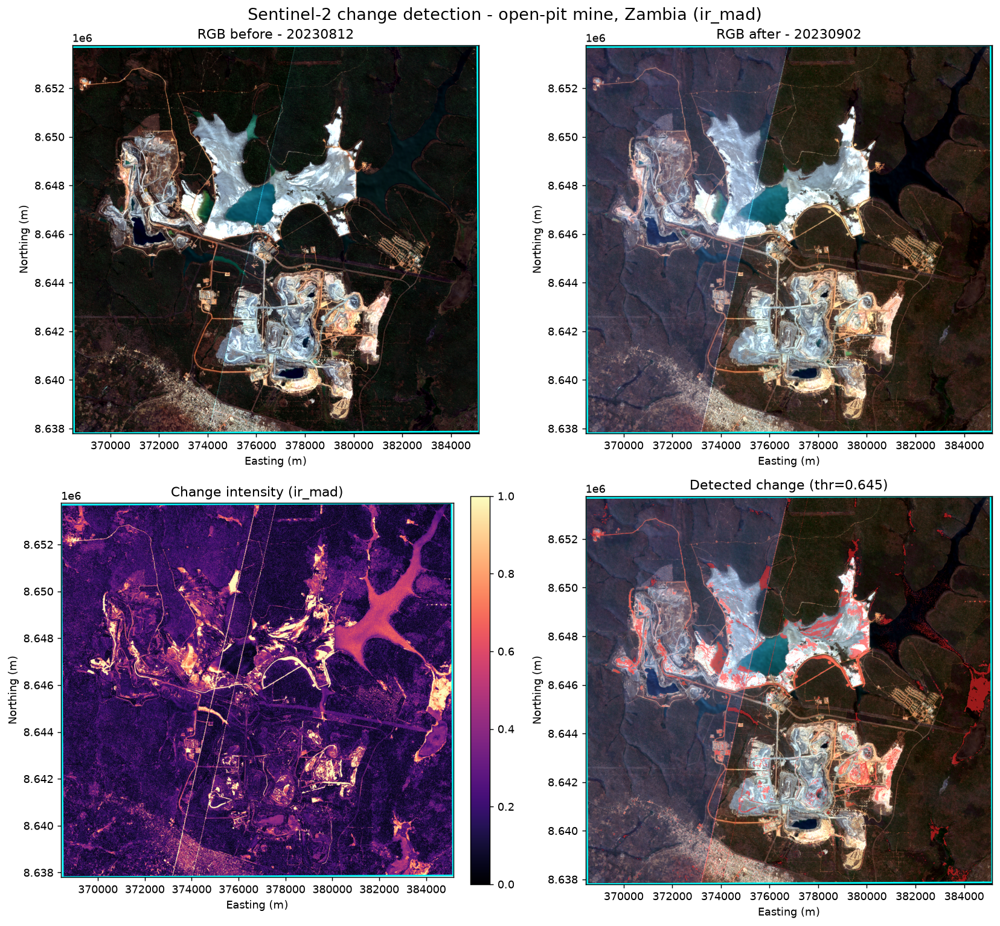
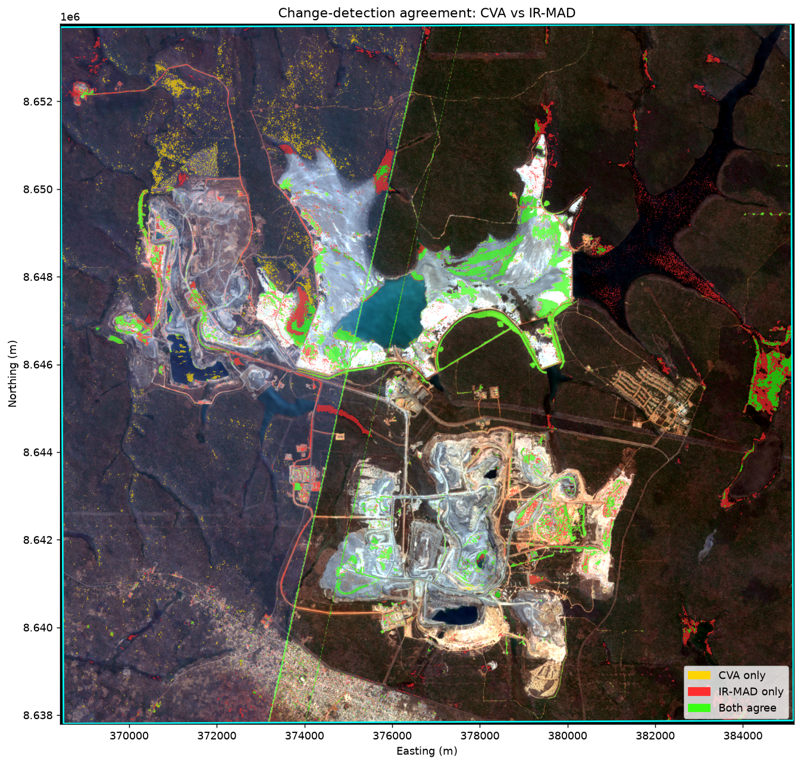
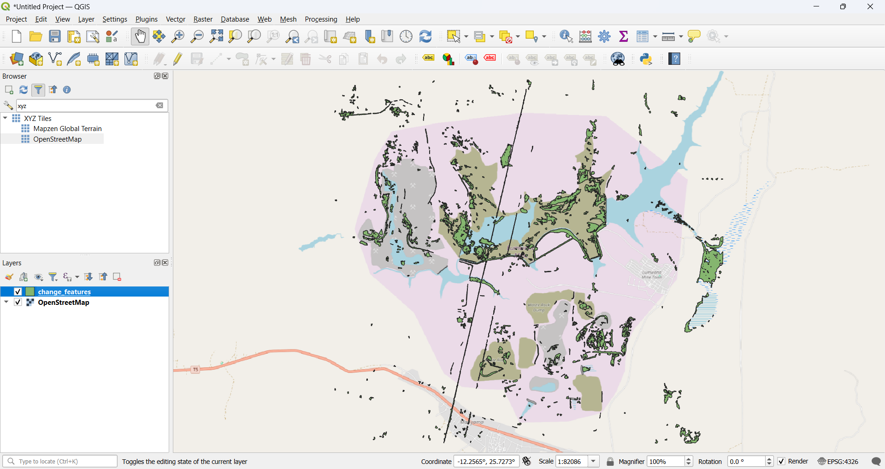
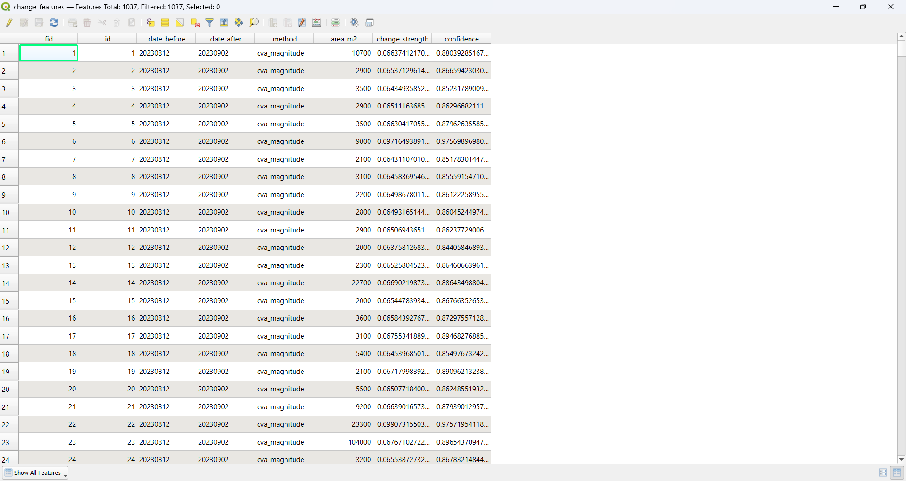

# Sentinel-2 Change Analysis

A bitemporal change analysis of the Lumwana open-pit copper mine in North-Western Zambia, using
Sentinel-2 optical imagery. The work compares two change-detection methods and stores the results as
queryable spatial features.

|  |  |
|---|---|
| Site | Lumwana open-pit copper mine, NW Zambia (AOI about 267 km², 1597 x 1673 px at 10 m) |
| Dates | 2023-08-12 (before) to 2023-09-02 (after); 21 days, dry season |
| Bands | B2 Blue, B3 Green, B4 Red (visible only, no NIR/SWIR) |
| CRS | EPSG:32735 (WGS 84 / UTM 35S); 99.0% valid pixels |
| Methods | CVA magnitude (provided baseline) and IR-MAD |

## 1. Method

### 1.1 Data preparation
The three bands for each date are loaded by explicit folder path, since the filenames are identical
across dates. Each band is read with a nodata mask (nodata = 0) and the three are stacked
channels-last as [Blue, Green, Red]. CRS, affine transform and dimensions are read from the files and
asserted identical across all six rasters; the pipeline stops with an error otherwise, so the data is
trusted from the files rather than the brief. Digital numbers are scaled to reflectance (divide by
10000) before any index.

Only the visible bands (B2 to B4) are provided, so true NDVI, NDWI and the standard Bare Soil Index
cannot be computed. Vegetation and bare ground are instead described with visible-only proxies (VARI
and a brightness index), which are used to interpret the change rather than to detect it.

### 1.2 Radiometric drift between the two dates
The two scenes are not radiometrically identical: mean Red reflectance rises by 14.7%
(0.179 to 0.206) between dates, which is a global brightness or haze shift rather than real ground
change. Plain differencing would flag this everywhere. Two safeguards are applied: a relative
radiometric normalization (per-band least squares on the most stable pixels) before the CVA method,
and IR-MAD, which is invariant to linear brightness differences by design.

### 1.3 Methods compared
| Method | What it computes | Role |
|---|---|---|
| CVA magnitude | Euclidean distance of the 3-band difference vector, one change value per pixel | Required example method, brightness-driven baseline |
| IR-MAD | Iteratively Reweighted Multivariate Alteration Detection: canonical-correlation variates give a chi-square change magnitude that is invariant to linear brightness differences | Robust method chosen for this drifted pair |

CVA is the provided example algorithm, applied as the baseline. IR-MAD is the second, independent
method, chosen specifically because of the 14.7% brightness drift measured above. Deep-learning change
detection (Siamese and transformer networks) is the current research direction, but it needs labelled
training data; with a single unlabelled pair of images it offers no advantage here, so the work uses
two unsupervised methods that remain standard baselines in operational remote sensing.

Thresholding uses the classic rule mean + 2 standard deviations rather than Otsu. The change-magnitude
histograms here are unimodal (a large no-change mass with a change tail), so Otsu, which assumes two
modes, splits near the median and over-segments (about 38% of the scene). The mean + 2 sigma rule is
robust to this and is applied the same way to both methods for a fair comparison. The IR-MAD iteration
is capped so the reweighting does not collapse the no-change variance.

### 1.4 Vectorization and storage
The binary change map is converted to connected-component polygons (scipy.ndimage with
rasterio.features.shapes). Area is measured in a UTM CRS derived at run time (estimate_utm_crs), never
hard-coded, so it stays correct for any AOI. Polygons smaller than 2000 m2 are dropped as speckle, and
each polygon keeps a change_strength (mean raw magnitude) and a confidence (mean normalized
intensity). Features are written to PostGIS as geometry(Polygon, 4326), with a GeoPackage fallback
that is itself a SQLite spatial database.

## 2. Results

| Method | Changed pixels | Polygons (>2000 m2) | Total area |
|---|---:|---:|---:|
| CVA magnitude | 3.77% | 483 | 735.7 ha |
| IR-MAD | 5.50% | 554 | 1130.6 ha |

The two methods agree on the location and structure of the change and differ mainly in sensitivity.
IR-MAD detects about 50% more area, picking up subtler spectral change that the brightness-driven CVA
misses, while staying robust to the haze shift.

The per-method figure below (IR-MAD) shows the RGB before and after, the change intensity, and the
detected change in red over the after image. The change concentrates on the mine footprint: the pits,
the processing area, haul roads and the tailings and pond margins.

*Figure 1. IR-MAD. RGB before (top left) and after (top right), change intensity (bottom left), and
detected change in red over the after image (bottom right). AOI outline in cyan.*

Where the two methods agree (green below) maps almost exactly onto the active mine infrastructure and
the large central water and tailings pond, which is the high-confidence core of the result. Detections
unique to one method (yellow or red) are sparser and scattered, the expected residual of imperfect
radiometric matching.

*Figure 2. Agreement between CVA and IR-MAD over the after image. Green = both methods, yellow = CVA
only, red = IR-MAD only.*

Loading the stored features in QGIS over an OpenStreetMap basemap confirms the polygons fall directly
on the Lumwana workings.

*Figure 3. The change_features layer over OpenStreetMap. The polygons cluster on the Lumwana mine
pits, tailings and ponds.*

*Figure 4. Attribute table of change_features: id, date_before, date_after, method, area_m2,
change_strength, confidence and a typed geometry column.*

An interactive map (AOI and change polygons over a satellite basemap, with area and confidence on
hover) is in [figures/interactive_map.html](figures/interactive_map.html). A short screen recording of
it is in [figures/folium-solafune.mp4](figures/folium-solafune.mp4).

## 3. Interpretation

What the detected change most likely represents:

* Active mining, the primary signal. Reworking of tailings and stockpiles, pit-face and haul-road
  change, and changes in pond extent and level. The visible indices over the changed areas show
  brightness up and VARI down, consistent with fresh earth and material being exposed at an active
  open-pit operation.
* Water and wet material. The east-central pond carries the largest single magnitude (a 113 ha IR-MAD
  polygon at confidence 0.90); tailings ponds routinely change extent and turbidity week to week.
* Atmospheric and illumination effects, treated as noise. The 14.7% global brightness shift points to
  haze or a sun-angle difference. This is exactly why CVA is normalized and IR-MAD is included, and
  residual haze likely explains some of the scattered low-confidence detections.
* Seasonal vegetation, a minor factor. The dates are only 21 days apart and both in the dry season, so
  phenological change is small, and little vegetated land is flagged.

Confidence is high for the clustered, high-confidence polygons on the mine footprint where both
methods agree, and lower for the small, scattered, single-method polygons.
